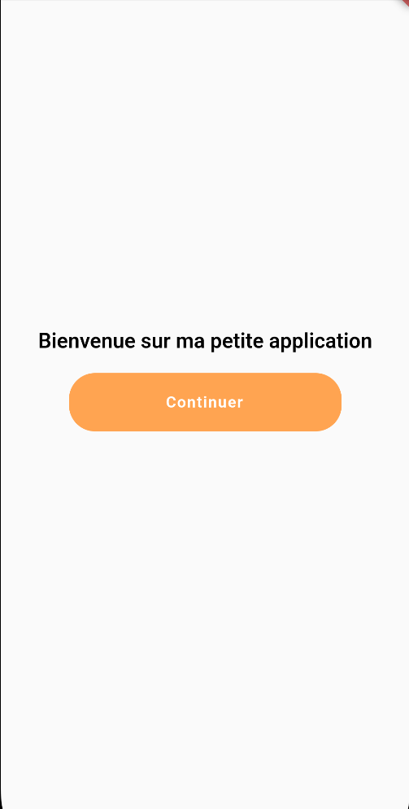
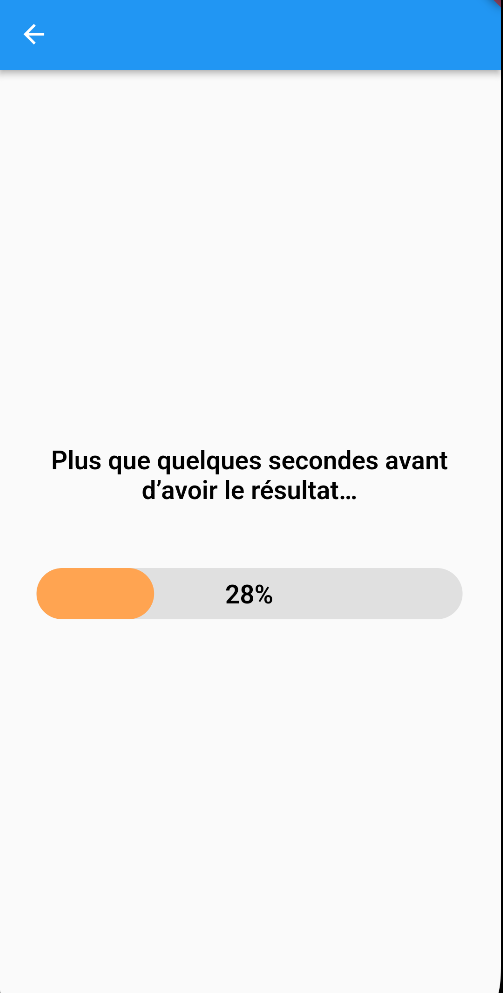

# Meteo App

The meteo app for the KATA test in flutter

## Getting started

You have, in  the root project :
 - launch the terminal and type :
	 -  `flutter pub get` *install dependencies*
	 -  `flutter run` *launch the app (you can run the app with your IDE)*

## How to use

You have to press the button in the home menu to get the weather of five country.

You can change this if you want to see others countries.

have fun !

